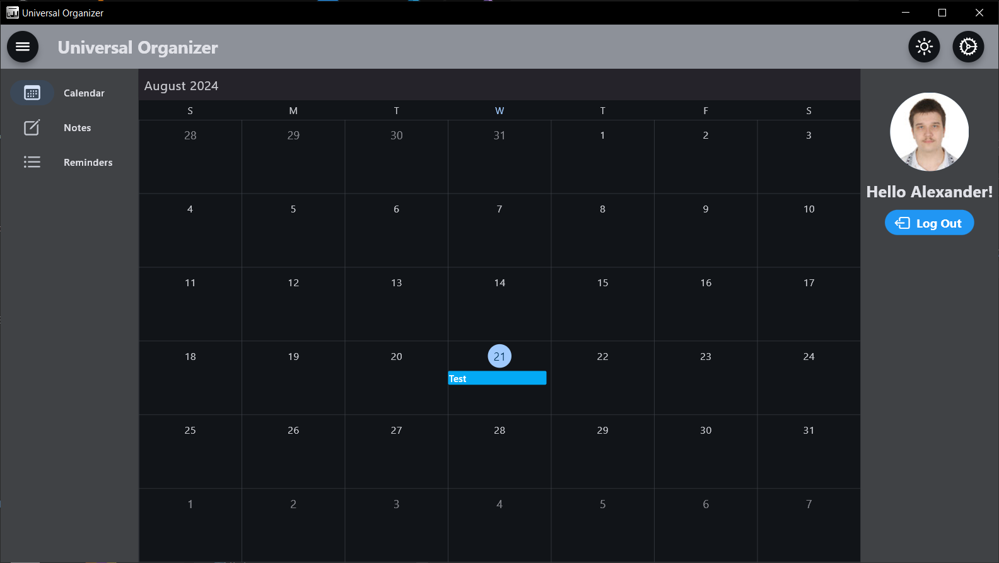
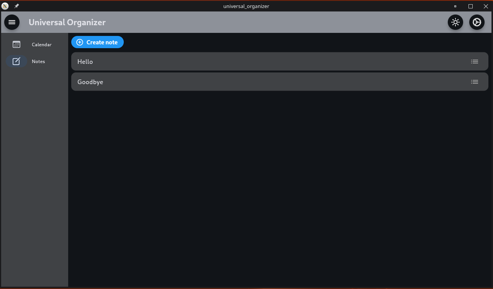

# Universal Organizer

CS50 2024 Final Project by Alexander Maykl Mychlo

## Runs on:

## Author

- [@alexmmych](https://github.com/alexmmych)

## FAQ

#### What does this software do?

This software has the utility of a calendar, notekeeper and reminder app that is cross-compatible between different Desktop platforms.

#### Why Flutter

I used Flutter not necessarily because it can also build for mobile because I can't really test for those platforms well (No Android phone or MacOS) but because it's easily compatible with desktop platforms like Windows and Linux, which is important because I switch on the daily between those two.

## Screenshots

## Features

- Light/dark mode toggle
- Cross compatibility between Windows and Linux
- Google Calendar synchronization
- Notes taking

## Acknowledgements

 - [Add Google Event Calendar to Flutter Event Calendar (SyncFusion)](https://github.com/SyncfusionExamples/add-google-event-calendar-to-flutter-event-calendar)
 - [Electronics icons created by xnimrodx - Flaticon](https://www.flaticon.com/free-icons/electronics)
 - [readme.so](https://readme.so/)

## 🔗 Links

